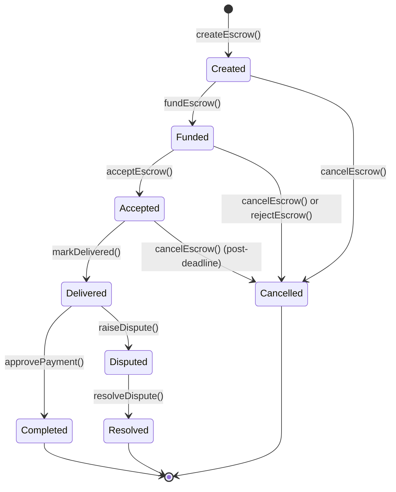
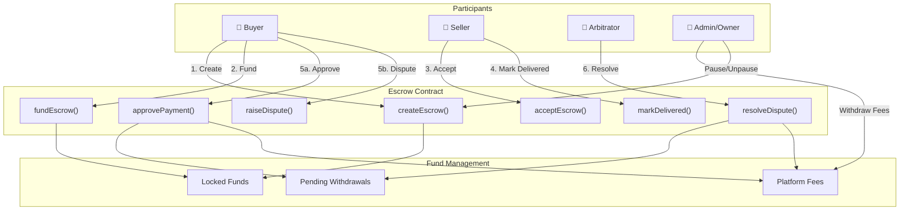
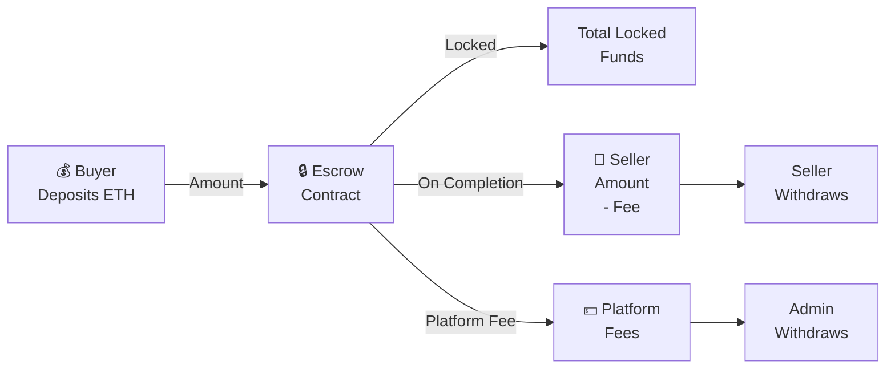

# Escrow Smart Contract Platform

A robust, production-grade decentralized escrow service built on Ethereum. This platform facilitates secure peer-to-peer transactions with arbitration capabilities, platform fee management, and comprehensive fund management.

**Version**: 1.0.0  
**Solidity**: 0.8.28  
**License**: MIT

---

## Table of Contents

- [Overview](#overview)
- [Key Features](#key-features)
- [Architecture](#architecture)
- [Project Structure](#project-structure)
- [Technical Specifications](#technical-specifications)
- [Smart Contract Functions](#smart-contract-functions)
- [Setup & Installation](#setup--installation)
- [Configuration](#configuration)
- [Usage Examples](#usage-examples)
- [Testing](#testing)
- [Deployment](#deployment)
- [Security Features](#security-features)
- [License](#license)

---

## Overview

The **Escrow Smart Contract** is a decentralized platform that enables secure transactions between buyers and sellers with the following core benefits:

- **Secure Fund Locking**: Buyer deposits funds that are held in escrow until conditions are met
- **Dispute Resolution**: Independent arbitrator can resolve conflicts between parties
- **Platform Monetization**: Configurable platform fee system with timelock protection
- **Flexible Cancellation**: Multiple cancellation pathways based on escrow state
- **Fund Safety**: Reentrancy protection and comprehensive error handling

### Use Cases

- **Freelance Services**: Developers and agencies can accept payments with escrow protection
- **Digital Assets**: Safe trading of NFTs, domains, and digital goods
- **Marketplace Integration**: E-commerce platforms can use escrow for buyer/seller protection
- **Cross-Chain Settlements**: Trustless transactions without centralized intermediaries

---

## Key Features

### Core Escrow Workflow



### Platform Architecture



### Multi-Party Fund Flow



---

## Project Structure

```
escrow/
├── contracts/
│   ├── Escrow.sol                 # Main escrow smart contract
│   └── events/
│       └── EscrowEvents.sol       # Event definitions
├── frontend/
│   ├── index.html                 # Web UI
│   ├── config.js                  # Dynamic configuration loader
│   └── config.json                # Environment config
├── scripts/
│   ├── deploy.js                  # Deployment script
│   └── interact.js                # Interaction examples
├── test/
│   ├── acceptEscrow.js
│   ├── approvePayment.js
│   ├── cancelEscrow.js
│   ├── constructor.js
│   ├── createEscrow.js
│   ├── fundEscrow.js
│   ├── MarkDelivered.js
│   └── platformFee.js
├── types/
│   └── ethers-contracts/          # Generated TypeScript types
├── hardhat.config.js              # Hardhat configuration
├── package.json                   # Dependencies
└── README.md                       # This file
```

---

## Technical Specifications

### Smart Contract Details

**Contract Name**: `Escrow`  
**Network**: Ethereum Sepolia (configurable)  
**Language**: Solidity 0.8.28

### Key State Variables

```solidity
// Core escrow tracking
mapping(uint256 => EscrowInfo) private escrows;
mapping(address => uint256[]) private buyerEscrows;
mapping(address => uint256[]) private sellerEscrows;

// Fund management
uint256 public totalLockedFunds;           // Funds in active escrows
uint256 public totalPendingWithdrawals;    // Funds pending user withdrawal
uint256 public accumulatedFees;            // Platform fees pending withdrawal

// Platform fee configuration
uint96 public platformFee;                 // Current platform fee (basis points)
uint96 public pendingFee;                  // Pending fee change
uint256 public feeChangeUnlockTime;        // Timelock for fee changes
```

### EscrowStatus Enum

```solidity
enum EscrowStatus {
    Created,      // 0 - Initial state after creation
    Funded,       // 1 - Buyer has deposited funds
    Accepted,     // 2 - Seller has accepted the escrow
    Delivered,    // 3 - Seller marked work as delivered
    Completed,    // 4 - Buyer approved payment
    Cancelled,    // 5 - Transaction cancelled
    Disputed,     // 6 - Dispute raised by buyer or seller
    Resolved      // 7 - Arbitrator resolved dispute
}
```

### EscrowInfo Structure

```solidity
struct EscrowInfo {
    uint256 id;                   // Unique escrow identifier
    address buyer;                // Buyer address
    address seller;               // Seller address
    address arbitrator;           // Dispute arbitrator
    uint256 amount;               // Escrow amount in wei
    uint256 deadline;             // Deadline timestamp
    uint256 createdAt;            // Creation timestamp
    uint96 platformFee;           // Fee percentage (basis points)
    EscrowStatus status;          // Current status
    bool exists;                  // Existence flag for validation
}
```

### Constants

```solidity
uint96 public constant FEE_DENOMINATOR = 10_000;    // Fee basis (10,000 = 100%)
uint96 public constant MAX_FEE = 1_000;             // Maximum 10% platform fee
uint256 public constant FEE_TIMELOCK = 2 days;      // 2-day timelock for fee changes
```

---

## Smart Contract Functions

### Escrow Creation & Management

#### `createEscrow(address seller, address arbitrator, uint256 amount, uint256 deadline)`
Creates a new escrow agreement between buyer and seller.

**Parameters**:
- `seller` - Address of the service provider
- `arbitrator` - Address of dispute arbitrator
- `amount` - Escrow amount in wei
- `deadline` - Unix timestamp for transaction deadline

**Requirements**:
- Seller and arbitrator cannot be the buyer
- All addresses must be valid (non-zero)
- Amount must be greater than zero
- Deadline must be in the future

**Events**: `EscrowCreated`

---

#### `fundEscrow(uint256 escrowId)`
Buyer deposits funds into the escrow contract.

**Parameters**:
- `escrowId` - ID of the escrow to fund

**Requirements**:
- Caller must be the buyer
- Escrow must be in `Created` status
- Sent value must match escrow amount exactly

**Events**: `EscrowFunded`

---

#### `acceptEscrow(uint256 escrowId)`
Seller accepts the escrow and commits to delivering the service.

**Parameters**:
- `escrowId` - ID of the escrow to accept

**Requirements**:
- Caller must be the seller
- Escrow must be in `Funded` status
- Transaction deadline must not have passed

**Events**: `EscrowAccepted`

---

#### `markDelivered(uint256 escrowId)`
Seller marks the work/goods as delivered.

**Parameters**:
- `escrowId` - ID of the escrow

**Requirements**:
- Caller must be the seller
- Escrow must be in `Accepted` status
- Deadline must not have passed

**Events**: `WorkDelivered`

---

### Payment & Approval

#### `approvePayment(uint256 escrowId)`
Buyer approves the payment and releases funds to the seller (minus platform fee).

**Parameters**:
- `escrowId` - ID of the escrow

**Requirements**:
- Caller must be the buyer
- Escrow must be in `Delivered` status
- Must use reentrancy guard

**Processing**:
1. Calculates platform fee: `amount × platformFee / 10,000`
2. Transfers seller amount to pending withdrawals
3. Adds fee to accumulated platform fees
4. Updates locked funds counter
5. Sets status to `Completed`

**Events**: `PaymentReleased`

---

### Cancellation & Rejection

#### `cancelEscrow(uint256 escrowId)`
Buyer can cancel the escrow under specific conditions.

**Cancellation Rules**:

| Status | Condition | Action |
|--------|-----------|--------|
| `Created` | Always allowed | Cancel immediately |
| `Funded` | Always allowed | Refund buyer |
| `Accepted` | Deadline must have passed | Refund buyer |

**Events**: `EscrowCancelled`

---

#### `rejectEscrow(uint256 escrowId)`
Seller can reject a funded escrow and return funds to buyer.

**Parameters**:
- `escrowId` - ID of the escrow

**Requirements**:
- Caller must be the seller
- Escrow must be in `Funded` status

**Events**: `EscrowCancelled`

---

### Dispute Resolution

#### `raiseDispute(uint256 escrowId)`
Either buyer or seller can raise a dispute during the `Delivered` state.

**Parameters**:
- `escrowId` - ID of the escrow

**Requirements**:
- Caller must be buyer or seller
- Escrow must be in `Delivered` status

**Events**: `DisputeRaised`

---

#### `resolveDispute(uint256 escrowId, address winner)`
Arbitrator resolves the dispute by determining the winner.

**Parameters**:
- `escrowId` - ID of the escrow
- `winner` - Address of dispute winner (buyer or seller)

**Processing**:
- If seller wins: Release amount minus platform fee
- If buyer wins: Refund full amount
- Platform fee only charged if seller wins

**Requirements**:
- Caller must be the arbitrator
- Escrow must be in `Disputed` status
- Winner must be buyer or seller

**Events**: `DisputeResolved`

---

### Fund Withdrawal

#### `withdraw()`
Users withdraw their pending funds (from completed transactions or refunds).

**Processing**:
1. Retrieves pending withdrawal amount
2. Clears pending balance
3. Updates total pending withdrawals
4. Transfers ETH via low-level call (reentrancy protected)

**Events**: `Withdrawn`

---

#### `withdrawFees(address receiver)`
Owner withdraws accumulated platform fees.

**Parameters**:
- `receiver` - Address to receive fees

**Requirements**:
- Caller must be contract owner
- Must be sufficient fees accumulated
- Contract must maintain solvency (balance ≥ locked + pending + fees)

**Events**: `FeesWithdrawn`

---

### Platform Fee Management

#### `proposePlatformFee(uint96 newFee)`
Owner proposes a new platform fee with timelock.

**Parameters**:
- `newFee` - New fee in basis points (max 1,000 = 10%)

**Requirements**:
- Caller must be owner
- Fee must not exceed 10%
- Fee must differ from current fee

**Timelock**: 2 days before execution

**Events**: `PlatformFeeProposed`

---

#### `executePlatformFee()`
Executes the proposed fee change after timelock expires.

**Requirements**:
- A fee change must be pending
- Timelock must have elapsed

**Events**: `PlatformFeeUpdated`

---

### Utility Functions

#### `getEscrow(uint256 escrowId)`
Retrieves full escrow details.

**Returns**: `EscrowInfo` struct containing all escrow data

---

#### `getBuyerEscrows(address buyer)`
Retrieves all escrows where caller is the buyer.

**Returns**: Array of escrow IDs

---

#### `getSellerEscrows(address seller)`
Retrieves all escrows where caller is the seller.

**Returns**: Array of escrow IDs

---

### Administrative Functions

#### `pause()`
Owner can pause all non-view operations (emergency stop).

---

#### `unpause()`
Owner can resume operations after pause.

---

#### `rescueETH(address receiver, uint256 amount)`
Owner can rescue accidentally sent ETH (only "orphaned" funds).

**Safety**: Only allows withdrawal of funds not allocated to escrows, pending withdrawals, or fees.

---

#### `depositETH()`
Owner can deposit ETH to cover contract obligations.

---

## Setup & Installation

### Prerequisites

- **Node.js**: v16 or higher
- **npm**: v8 or higher
- **Git**: For cloning the repository
- **MetaMask** or compatible wallet: For frontend interactions

### Installation Steps

```bash
# 1. Clone the repository
git clone <repository-url>
cd escrow

# 2. Install dependencies
npm install

# 3. Create environment file
cp .env.example .env

# 4. Configure environment variables
# Edit .env with your settings (see Configuration section below)

# 5. Verify installation
npm list
```

### Installed Dependencies

**Development**:
- `hardhat` - Ethereum development environment
- `@nomicfoundation/hardhat-ethers` - Ethers.js integration
- `@nomicfoundation/hardhat-verify` - Contract verification
- `chai` - Testing framework
- `prettier` & `prettier-plugin-solidity` - Code formatting

**Production**:
- `dotenv` - Environment variable management

---

## Configuration

### Environment Variables (.env)

```env
# Sepolia Testnet Configuration
SEPOLIA_RPC_URL=https://sepolia.infura.io/v3/YOUR_INFURA_KEY
PRIVATE_KEY=0xYourPrivateKeyHere
ETHERSCAN_API_KEY=YOUR_ETHERSCAN_KEY

# Optional: Alchemy or custom RPC provider
# ALCHEMY_API_KEY=your_alchemy_key
```

### Hardhat Network Configuration

```javascript
// hardhat.config.js
networks: {
  sepolia: {
    url: process.env.SEPOLIA_RPC_URL,
    accounts: [process.env.PRIVATE_KEY],
  },
  // Add additional networks as needed
  mainnet: {
    url: process.env.MAINNET_RPC_URL,
    accounts: [process.env.PRIVATE_KEY],
  }
}
```

### Frontend Configuration (frontend/config.json)

```json
{
  "escrow-contract-address": "0xYourDeployedContractAddress",
  "escrow-admin-address": "0xAdminWalletAddress"
}
```

---

## Usage Examples

### 1. Basic Escrow Flow

```javascript
import { ethers } from "ethers";

// Connect to contract
const escrowAddress = "0x...";
const escrowABI = [...]; // Import from artifacts
const contract = new ethers.Contract(escrowAddress, escrowABI, signer);

// Step 1: Buyer creates escrow
const seller = "0xSellerAddress";
const arbitrator = "0xArbitratorAddress";
const amount = ethers.parseEther("1.0"); // 1 ETH
const deadline = Math.floor(Date.now() / 1000) + 86400 * 7; // 7 days

const tx1 = await contract.createEscrow(
  seller,
  arbitrator,
  amount,
  deadline
);
const receipt1 = await tx1.wait();
const escrowId = receipt1.logs[0].args.escrowId;

console.log("Escrow created:", escrowId);
```

### 2. Funding the Escrow

```javascript
// Buyer funds the escrow
const tx2 = await contract.fundEscrow(escrowId, {
  value: amount
});
await tx2.wait();

console.log("Escrow funded");
```

### 3. Seller Accepts and Delivers

```javascript
// Seller accepts
const tx3 = await contract.connect(sellerSigner).acceptEscrow(escrowId);
await tx3.wait();

// Seller marks as delivered
const tx4 = await contract.connect(sellerSigner).markDelivered(escrowId);
await tx4.wait();

console.log("Work delivered");
```

### 4. Buyer Approves Payment

```javascript
// Buyer approves and releases payment
const tx5 = await contract.approvePayment(escrowId);
await tx5.wait();

console.log("Payment approved");

// Seller withdraws funds
const tx6 = await contract.connect(sellerSigner).withdraw();
await tx6.wait();

console.log("Seller received payment");
```

### 5. Dispute Scenario

```javascript
// If buyer disputes, arbitrator can resolve
const tx_dispute = await contract.connect(buyerSigner).raiseDispute(escrowId);
await tx_dispute.wait();

// Arbitrator resolves in favor of seller
const tx_resolve = await contract
  .connect(arbitratorSigner)
  .resolveDispute(escrowId, seller);
await tx_resolve.wait();

console.log("Dispute resolved");
```

### 6. Query Escrow Data

```javascript
// Get escrow details
const escrowInfo = await contract.getEscrow(escrowId);
console.log("Escrow Info:", {
  id: escrowInfo.id,
  buyer: escrowInfo.buyer,
  seller: escrowInfo.seller,
  amount: ethers.formatEther(escrowInfo.amount),
  status: escrowInfo.status,
  deadline: new Date(escrowInfo.deadline * 1000)
});

// Get all escrows for a user
const buyerEscrows = await contract.getBuyerEscrows(buyerAddress);
const sellerEscrows = await contract.getSellerEscrows(sellerAddress);

console.log(`Buyer has ${buyerEscrows.length} escrows`);
console.log(`Seller has ${sellerEscrows.length} escrows`);
```

---

## Testing

### Running Tests

```bash
# Run all tests
npm test

# Run specific test file
npm test test/createEscrow.js

# Run with gas reporting
REPORT_GAS=true npm test

# Run tests on specific network
npx hardhat test --network sepolia
```

### Available Test Suites

- `test/constructor.js` - Contract initialization tests
- `test/createEscrow.js` - Escrow creation validation
- `test/fundEscrow.js` - Funding mechanism tests
- `test/acceptEscrow.js` - Seller acceptance tests
- `test/MarkDelivered.js` - Delivery marking tests
- `test/approvePayment.js` - Payment approval and fund release
- `test/cancelEscrow.js` - Cancellation scenarios
- `test/platformFee.js` - Platform fee management

### Writing New Tests

```javascript
const { expect } = require("chai");
const { ethers } = require("hardhat");

describe("Escrow", function () {
  let escrow;
  let owner, buyer, seller, arbitrator;
  const PLATFORM_FEE = 250; // 2.5%
  const AMOUNT = ethers.parseEther("1.0");

  beforeEach(async function () {
    [owner, buyer, seller, arbitrator] = await ethers.getSigners();
    
    const Escrow = await ethers.getContractFactory("Escrow");
    escrow = await Escrow.deploy(owner.address, PLATFORM_FEE);
  });

  it("Should create an escrow", async function () {
    const deadline = Math.floor(Date.now() / 1000) + 86400;
    
    await expect(
      escrow.connect(buyer).createEscrow(
        seller.address,
        arbitrator.address,
        AMOUNT,
        deadline
      )
    ).to.emit(escrow, "EscrowCreated");
  });
});
```

---

## Deployment

### Local Testing with Hardhat Node

```bash
# Start local blockchain
npx hardhat node

# In another terminal, deploy to local network
npx hardhat run scripts/deploy.js --network localhost
```

### Deploying to Sepolia Testnet

```bash
# Ensure your .env is configured with SEPOLIA_RPC_URL and PRIVATE_KEY

# Deploy contract
npx hardhat run scripts/deploy.js --network sepolia

# Verify on Etherscan (requires ETHERSCAN_API_KEY)
npx hardhat verify --network sepolia <CONTRACT_ADDRESS> <CONSTRUCTOR_ARGS>
```

### Deployment Script (scripts/deploy.js)

```javascript
async function main() {
  const initialOwner = "0xAb591dC206ebB22fD44ed8B1588475a02ceBE31D";
  const platformFee = 250; // 2.5%

  const Escrow = await ethers.getContractFactory("Escrow");
  const escrow = await Escrow.deploy(initialOwner, platformFee);

  await escrow.waitForDeployment();

  console.log("Escrow deployed to:", await escrow.getAddress());
  console.log("Owner:", initialOwner);
  console.log("Platform Fee: 2.5%");
}

main().catch((error) => {
  console.error(error);
  process.exitCode = 1;
});
```

### Deployment Checklist

- [ ] Environment variables configured correctly
- [ ] Sufficient ETH in deployer account for gas
- [ ] Contract verified on block explorer
- [ ] Frontend config updated with new contract address
- [ ] Initial platform fee set appropriately (2-10% recommended)
- [ ] Owner address verified
- [ ] Arbitration mechanism established

---

## Security Features

### Smart Contract Security

#### 1. **Reentrancy Protection**
```solidity
// All state-changing fund transfers use nonReentrant modifier
function approvePayment(uint256 escrowId)
    external
    nonReentrant
    // ...
```

#### 2. **Address Validation**
```solidity
// All addresses validated before use
modifier requireValidAddress(address account) {
    require(account != address(0), "Invalid address");
    _;
}
```

#### 3. **Amount Validation**
```solidity
// Strict amount checking prevents mismatches
if (msg.value != escrow.amount) {
    revert AmountMismatch();
}
```

#### 4. **State Machine Enforcement**
```solidity
// Only specific state transitions allowed
modifier whenStatus(uint256 escrowId, EscrowStatus expectedStatus) {
    require(escrows[escrowId].status == expectedStatus, "Invalid status");
    _;
}
```

#### 5. **Timelock for Critical Changes**
```solidity
// 2-day timelock before fee changes take effect
uint256 public constant FEE_TIMELOCK = 2 days;

function proposePlatformFee(uint96 newFee) external onlyOwner {
    pendingFee = newFee;
    feeChangeUnlockTime = block.timestamp + FEE_TIMELOCK;
}
```

#### 6. **Emergency Pause Mechanism**
```solidity
// Admin can pause all operations in case of exploit
function pause() external onlyOwner {
    _pause();
}
```

#### 7. **Fund Tracking & Validation**
```solidity
// Contract maintains accurate fund accounting
uint256 public totalLockedFunds;
uint256 public totalPendingWithdrawals;
uint256 public accumulatedFees;

// Ensures contract solvency
require(
    address(this).balance >= totalLockedFunds + totalPendingWithdrawals + accumulatedFees,
    "Insufficient balance"
);
```

#### 8. **Orphaned Fund Rescue**
```solidity
// Only "orphaned" funds can be rescued
function rescueETH(address receiver, uint256 amount) external onlyOwner {
    uint256 available = address(this).balance 
        - totalLockedFunds 
        - totalPendingWithdrawals 
        - accumulatedFees;
    require(amount <= available, "Insufficient rescue balance");
}
```

### Security Best Practices

1. **Access Control**: Role-based checks (buyer, seller, arbitrator, owner)
2. **Input Validation**: All parameters validated before processing
3. **Fund Safety**: Separate tracking of locked, pending, and fee funds
4. **Atomic Operations**: All fund transfers wrapped in nonReentrant guards
5. **Gas Optimization**: Efficient storage patterns to minimize costs
6. **Event Logging**: All critical actions emit events for off-chain monitoring

### Audit Recommendations

- [ ] Professional smart contract audit by reputable firm
- [ ] Formal verification of critical fund transfer logic
- [ ] Fuzzing tests for edge cases
- [ ] Mainnet deployment on testnet first
- [ ] Security incident response plan

---

## Common Issues & Troubleshooting

### Issue: "Invalid Platform Fee"
**Cause**: Platform fee exceeds 10% (1,000 basis points)  
**Solution**: Set fee to ≤ 1,000 (e.g., 250 for 2.5%)

### Issue: "Deadline Passed"
**Cause**: Current block timestamp exceeds escrow deadline  
**Solution**: Create escrow with future deadline

### Issue: "Amount Mismatch"
**Cause**: Sent value doesn't match escrow amount  
**Solution**: Ensure `msg.value` equals exact escrow amount in wei

### Issue: "Contract Paused"
**Cause**: Owner has paused the contract  
**Solution**: Contact admin to unpause contract

### Issue: "No Withdrawal Available"
**Cause**: No pending funds for caller  
**Solution**: Complete an escrow or get refunded first

---

## Performance & Optimization

### Gas Optimization Techniques

- **Unchecked Blocks**: Used for safe counter increments
- **Storage Packing**: Variables optimally arranged in storage slots
- **Efficient Mappings**: Direct address-to-amount lookups
- **Minimal State Changes**: Function logic optimized to reduce writes

### Estimated Gas Costs (Sepolia)

| Operation | Gas | Cost (USD @ $2000/ETH) |
|-----------|-----|-------------------------|
| Create Escrow | ~95,000 | ~$0.38 |
| Fund Escrow | ~45,000 | ~$0.18 |
| Accept Escrow | ~25,000 | ~$0.10 |
| Approve Payment | ~55,000 | ~$0.22 |
| Withdraw | ~30,000 | ~$0.12 |

---

## Events Reference

### Creation Events
- `EscrowCreated(escrowId, buyer, seller, arbitrator, amount, deadline)`
- `EscrowFunded(escrowId, buyer, amount)`

### Status Events
- `EscrowAccepted(escrowId, seller)`
- `WorkDelivered(escrowId, seller)`
- `EscrowCancelled(escrowId, cancelledBy)`

### Payment Events
- `PaymentReleased(escrowId, seller, sellerAmount, platformFee)`
- `Withdrawn(account, amount)`
- `FeesWithdrawn(receiver, amount)`

### Dispute Events
- `DisputeRaised(escrowId, raisedBy)`
- `DisputeResolved(escrowId, winner, amount)`

### Administrative Events
- `PlatformFeeProposed(newFee, unlockTime)`
- `PlatformFeeUpdated(oldFee, newFee)`
- `ETHRescued(receiver, amount)`
- `ETHDeposited(sender, amount)`

---

## Roadmap & Future Enhancements

### Phase 2 Features
- Multi-token escrow support (stablecoins)
- Milestone-based releases (partial fund release)
- Insurance pool for dispute resolution
- DAO governance for fee management
- Cross-chain escrow via bridge protocols

### Phase 3 Features
- NFT-based reputation system
- Automated arbitrator assignment
- Integration with oracle services
- Advanced dispute resolution mechanics

---

## Contributing

Contributions are welcome! Please follow these steps:

1. Fork the repository
2. Create a feature branch (`git checkout -b feature/amazing-feature`)
3. Commit changes (`git commit -m 'Add amazing feature'`)
4. Push to branch (`git push origin feature/amazing-feature`)
5. Open a Pull Request

### Development Guidelines

- Follow Solidity style guide (prettier-plugin-solidity)
- Add tests for new features
- Update documentation
- Ensure all tests pass

---

## Support & Community

- **Documentation**: See inline comments in smart contract
- **Issues**: Report bugs via GitHub Issues
- **Discussions**: Community forum for feature requests
- **Email**: support@escrow.example.com

---

## License

This project is licensed under the MIT License - see the LICENSE file for details.

```
MIT License

Copyright (c) 2024 Escrow Platform

Permission is hereby granted, free of charge, to any person obtaining a copy
of this software and associated documentation files (the "Software"), to deal
in the Software without restriction, including without limitation the rights
to use, copy, modify, merge, publish, distribute, sublicense, and/or sell
copies of the Software, and to permit persons to whom the Software is
furnished to do so, subject to the following conditions:

The above copyright notice and this permission notice shall be included in all
copies or substantial portions of the Software.
```

---

## Disclaimer

This smart contract is provided as-is. While comprehensive security measures have been implemented, users should conduct their own risk assessment. The authors are not liable for any losses or damages resulting from the use of this contract. Always perform thorough testing on testnets before mainnet deployment.

---

**Last Updated**: 2024  
**Maintained By**: Development Team  
**Status**: Production Ready ✅
